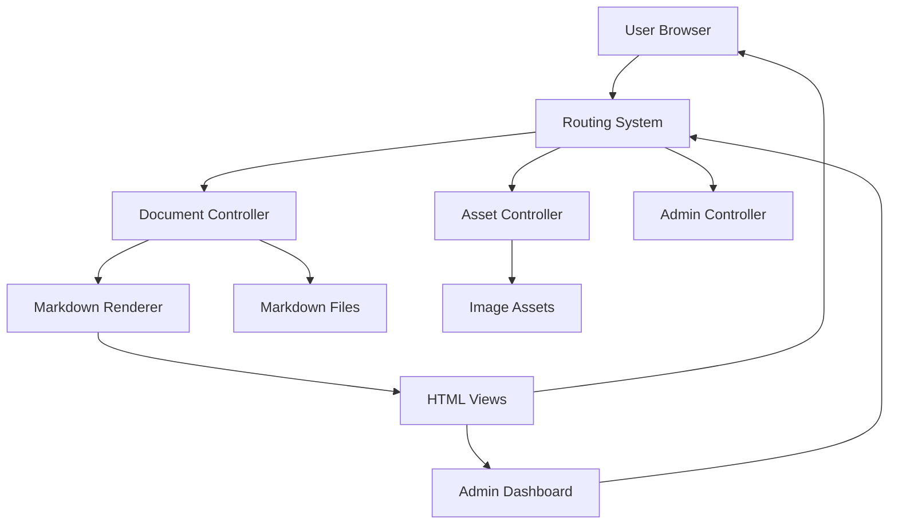
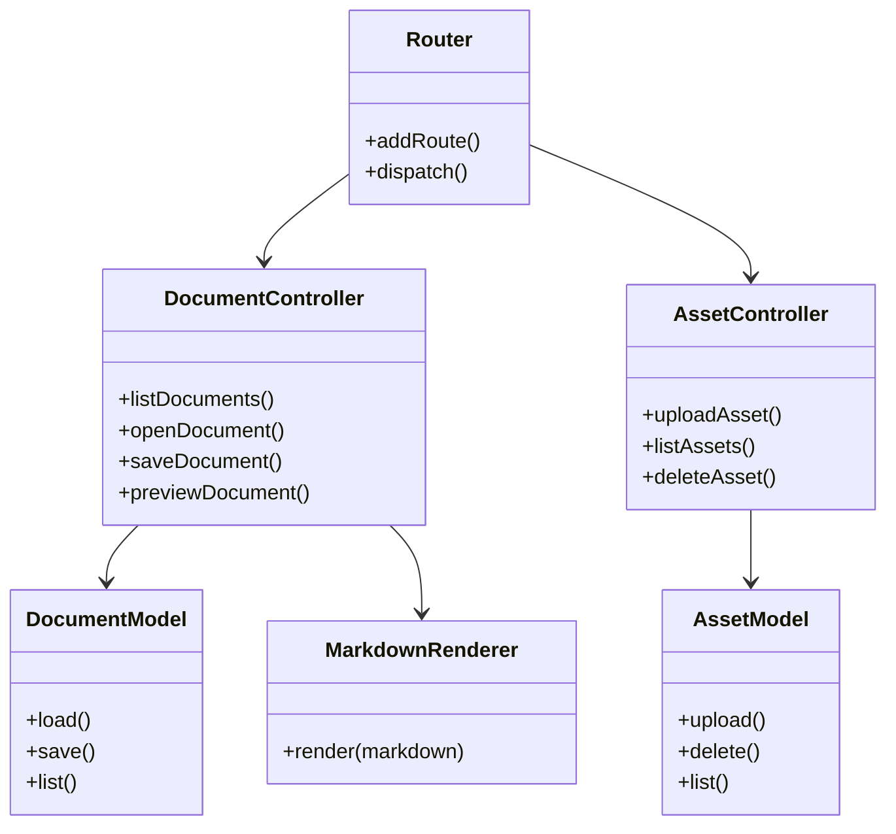
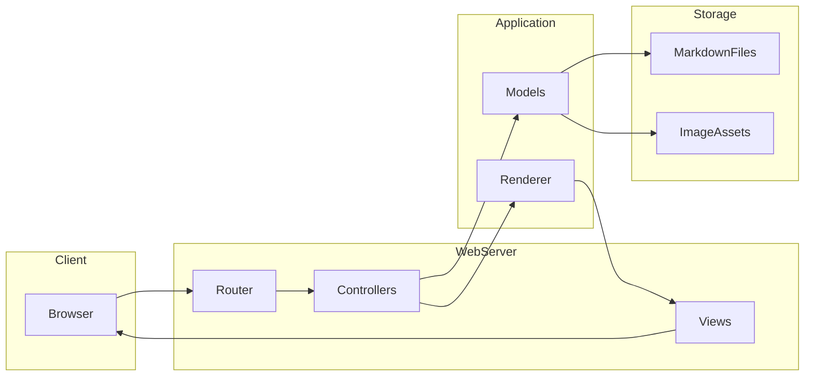
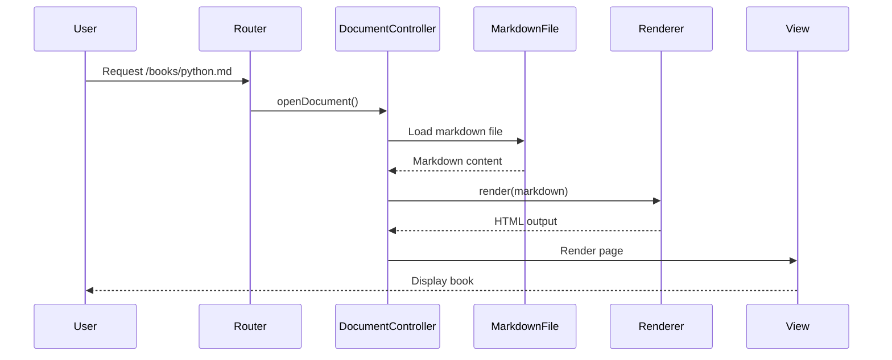
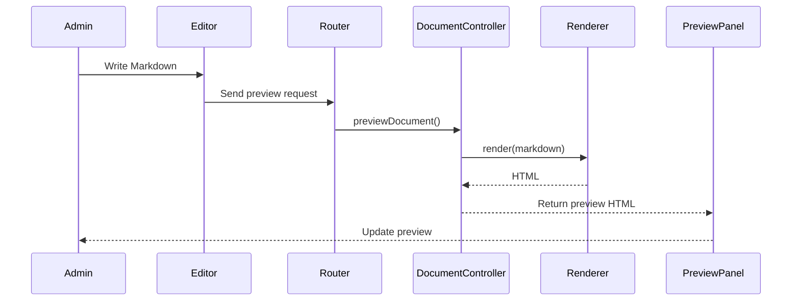
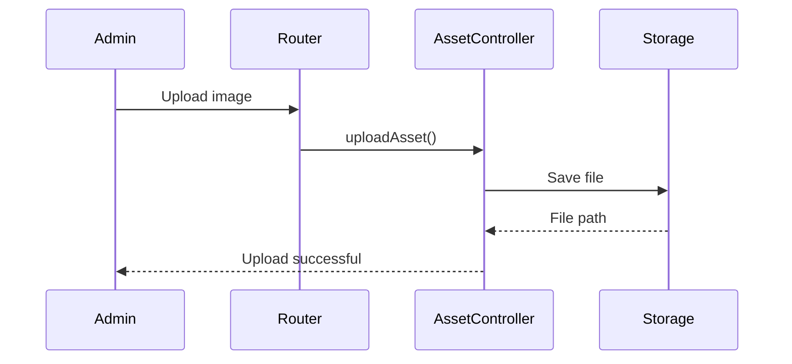
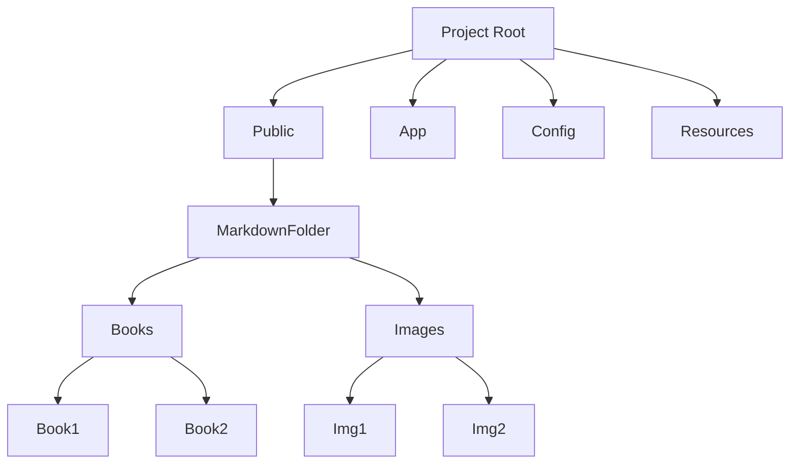
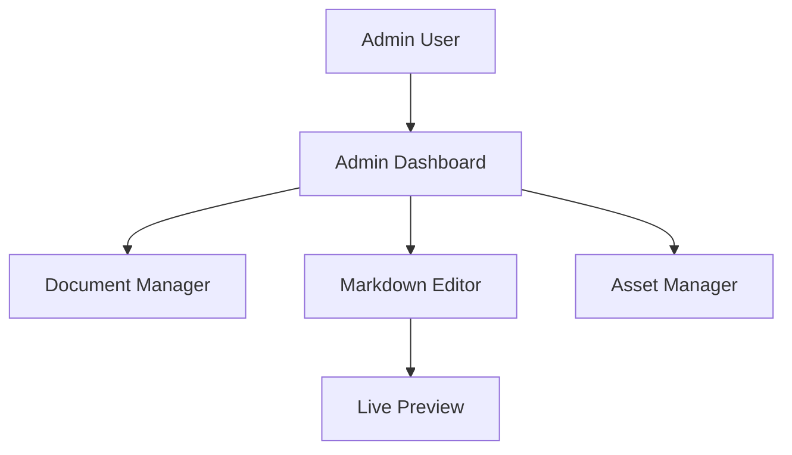

# MarkdownReader

*A Lightweight Markdown Book Reader and Editor Platform*

## 1. Introduction

**MarkdownReader** is a lightweight web-based platform designed to read, manage, and edit Markdown documents such as books, documentation, and technical notes. The system enables administrators to upload, edit, preview, and manage Markdown-based content through a clean dashboard interface.

The project is focused on simplicity, performance, and maintainability. It stores books as plain `.md` files and renders them dynamically into HTML for browser viewing.

MarkdownReader allows authors and administrators to:

* Write books in Markdown format
* Manage documents from a dashboard
* Upload and manage image assets
* Preview Markdown content live
* Render Markdown into structured HTML for readers

The platform is ideal for technical books, documentation sites, and knowledge bases.

---

# 2. Project Goals

The primary goals of MarkdownReader include:

### 2.1 Simplicity

The platform avoids unnecessary complexity by using plain Markdown files instead of database storage.

### 2.2 Performance

Content is loaded directly from the filesystem, ensuring fast access and low overhead.

### 2.3 Author-Friendly Workflow

Authors can focus on writing Markdown content while the system handles rendering, previews, and asset management.

### 2.4 Maintainability

The architecture uses a modular structure that keeps the codebase easy to maintain and extend.

---

# 3. System Architecture

MarkdownReader follows a simplified MVC-style architecture.

```
app/
 ├── Controllers
 ├── Models
 ├── Views
 ├── Core
 └── Helpers

config/
public/
resources/
markdown/
```

### 3.1 Core Components

| Component   | Description                                      |
| ----------- | ------------------------------------------------ |
| Controllers | Handle HTTP requests and business logic          |
| Models      | Manage markdown documents and assets             |
| Views       | Render HTML interfaces                           |
| Core        | Framework components such as Router and Renderer |
| Config      | Application constants and configuration          |

---

# 4. Key Features

## 4.1 Markdown Book Reader

The platform renders `.md` documents as readable HTML pages.

Features include:

* Automatic Markdown parsing
* Clean typography
* Table of contents generation
* Image rendering
* Asset path normalization

Books are stored inside:

```
/public/markdown/
```

Example:

```
public/markdown/
 ├── python-book.md
 └── images/
```

---

# 4.2 Markdown Renderer

The **MarkdownRenderer** converts Markdown into HTML using a CommonMark-compatible parser.

Capabilities include:

* Heading detection
* Table of contents generation
* Image URL normalization
* Link rendering
* HTML-safe output

The renderer ensures consistency between:

* The **public reader**
* The **admin preview**

---

# 4.3 Document Discovery

MarkdownReader automatically detects all Markdown files stored in the content directory.

Example:

```
public/markdown/
 ├── Book1.md
 ├── Book2.md
 └── images/
```

Each file becomes a readable book accessible through the web interface.

---

# 5. Admin Dashboard

The admin dashboard provides content management features for administrators.

Main functions:

* Document management
* Markdown editing
* Image asset management
* Preview functionality

Dashboard modules include:

* Document Library
* Markdown Editor
* Asset Manager

---

# 6. Markdown Editor

The built-in editor allows administrators to create and modify Markdown documents directly from the dashboard.

Features include:

* Title editing
* Markdown content editing
* Save functionality
* Integrated preview

The editor uses a **split-pane layout** for better writing workflow.

```
+-------------------+-------------------+
| Markdown Editor   | Live Preview      |
|                   |                   |
| Write Markdown    | Rendered HTML     |
|                   |                   |
+-------------------+-------------------+
```

---

# 7. Live Markdown Preview

The admin editor provides a **live preview panel** that renders Markdown while typing.

### How It Works

1. User writes Markdown in the editor
2. The editor sends content to a preview endpoint
3. The server processes the Markdown
4. The preview panel updates with rendered HTML

This ensures the preview uses the **same renderer as the public reader**.

Benefits:

* Accurate rendering
* Instant feedback
* Improved author productivity

---

# 8. Image Asset Management

MarkdownReader supports managing images used in Markdown documents.

Images are stored in:

```
/public/markdown/images/
```

---

## 8.1 Uploading Images

Admins can upload images directly from the dashboard.

Supported features:

* File upload
* Automatic storage
* Preview display
* Copy Markdown path

Example Markdown usage:

```

```

---

## 8.2 Asset Listing

The dashboard shows all uploaded images including:

* Thumbnail preview
* File name
* Markdown path
* Copy button
* Delete option

Example table:

| Image   | File        | Markdown Path      |
| ------- | ----------- | ------------------ |
| Preview | example.png | images/example.png |

---

## 8.3 Asset Deletion

Images can be deleted directly from the dashboard.

Deletion removes the file from:

```
/public/markdown/images/
```

---

# 9. Routing System

MarkdownReader uses a simple routing system to map URLs to controllers.

Example routes:

```
/books/{filename}
/admin/dashboard
/admin/documents
/admin/documents/preview
/admin/assets/upload
/admin/assets/delete
```

Routes are handled by the internal router located in:

```
app/Core/Router.php
```

---

# 10. Markdown Content Structure

A typical Markdown book may look like this:

```markdown
# Book Title

Intro paragraph.

## Chapter 1

Content here.

### Section

More content.


```

Rendered output includes:

* Headings
* Table of contents
* Images
* Links
* Lists

---

# 11. File Storage Strategy

MarkdownReader uses a **filesystem-based content storage model**.

Advantages:

* Easy backup
* Version control friendly
* No database dependency
* Simple deployment

Content structure:

```
public/
 └── markdown/
     ├── book1.md
     ├── book2.md
     └── images/
```

---

# 12. Security Considerations

The system implements several safeguards:

### CSRF Protection

Admin actions require CSRF tokens.

### File Upload Validation

Uploaded images are validated for:

* File type
* Size limits
* Storage path

### Path Normalization

All asset paths are sanitized before rendering.

---

# 13. Styling and UI

The interface uses modern CSS utilities for layout and responsiveness.

UI features include:

* Responsive design
* Split-pane editor
* Clean typography
* Markdown-friendly styling

The main stylesheet is located in:

```
resources/css/app.css
```

---

# 14. Development Workflow

Typical workflow for authors:

1. Open Admin Dashboard
2. Create or edit a Markdown document
3. Write content using Markdown syntax
4. Insert images from the asset manager
5. Preview the content live
6. Save the document
7. Publish automatically through the reader

---

# 15. Future Improvements

Planned enhancements may include:

* Markdown search
* Chapter navigation
* Syntax highlighting
* Book metadata support
* Markdown export tools
* Version history
* Multi-user editing

---

# 16. Conclusion

MarkdownReader provides a simple yet powerful platform for managing Markdown-based books and documentation. By combining a clean reading interface with a practical admin dashboard, the system enables authors to focus on writing while the platform handles rendering and asset management.

Its filesystem-based architecture ensures long-term maintainability, easy backups, and seamless integration with version control systems.

MarkdownReader is ideal for developers, educators, and technical writers who prefer writing content in Markdown while still benefiting from a structured publishing environment.

---

✅ If you'd like, I can also help you create:

* **A full 12–15 page professional Software Design Document**
* **Architecture diagrams**
* **README.md for GitHub**
* **API documentation**
* **System diagrams (MVC, routing, assets, preview flow)**

---

# Software Design Document

# MarkdownReader

**Project Name:** MarkdownReader
**Document Type:** Software Design Document (SDD)
**Version:** 1.0
**Date:** March 2026

---

# 1. Introduction

## 1.1 Purpose

This document describes the **software architecture and design** of the MarkdownReader system. It provides a detailed explanation of the system components, architecture, data flow, interfaces, and internal design.

The document is intended for:

* Developers
* System architects
* Project maintainers
* Technical reviewers

It serves as the primary reference for understanding how MarkdownReader is structured and implemented.

---

## 1.2 Scope

MarkdownReader is a lightweight web application designed for:

* Reading Markdown documents
* Managing Markdown-based books
* Editing Markdown content
* Rendering Markdown to HTML
* Managing image assets used in documents

The system provides two main interfaces:

1. **Public Reader Interface**
2. **Administrative Dashboard**

The platform stores content as plain Markdown files and renders them dynamically for web presentation.

---

## 1.3 Definitions and Acronyms

| Term       | Definition                                           |
| ---------- | ---------------------------------------------------- |
| Markdown   | Lightweight markup language used for formatting text |
| Renderer   | Component that converts Markdown into HTML           |
| Asset      | Image or media file used within Markdown documents   |
| Controller | Handles HTTP requests and coordinates responses      |
| Model      | Represents application data and business logic       |
| View       | HTML interface presented to users                    |

---

# 2. System Overview

MarkdownReader is designed as a **lightweight content reader and editor for Markdown-based books**.

Instead of using a database for storing content, MarkdownReader relies on the **filesystem** for simplicity and maintainability.

Main capabilities include:

* Reading Markdown books
* Editing Markdown files
* Live preview rendering
* Uploading and managing images
* Rendering images and links correctly
* Generating structured HTML output

---

# 3. Design Goals

The system is designed according to several key goals.

## 3.1 Simplicity

The system avoids unnecessary complexity by storing documents directly in Markdown files.

## 3.2 Performance

Markdown files are loaded directly from the filesystem without database queries.

## 3.3 Maintainability

The architecture follows a modular structure that separates concerns between components.

## 3.4 Author Productivity

Authors can write content quickly using Markdown while the system provides preview and rendering tools.

---

# 4. System Architecture

MarkdownReader follows a **modular MVC-style architecture**.

### High-Level Architecture

```
Client Browser
      |
      v
Routing System
      |
      v
Controllers
      |
      v
Models / Services
      |
      v
Markdown Renderer
      |
      v
Views (HTML Output)
```

---

# 5. Architectural Components

The system consists of several core components.

## 5.1 Router

The router maps incoming HTTP requests to controllers.

Example routes:

```
/books/{file}
/admin/dashboard
/admin/documents
/admin/assets
/admin/preview
```

Responsibilities:

* URL parsing
* Route matching
* Controller invocation

---

## 5.2 Controllers

Controllers coordinate application behavior.

Major controllers include:

### DocumentController

Handles Markdown document operations.

Functions:

* List documents
* Load document content
* Save document changes
* Preview rendering

---

### AssetController

Handles image asset management.

Functions:

* Upload images
* List stored images
* Delete assets

---

### AdminController

Manages administrative interface.

Functions:

* Dashboard rendering
* Navigation
* Admin authentication (if implemented)

---

# 6. Markdown Rendering Engine

The Markdown rendering engine converts Markdown text into HTML.

Rendering pipeline:

```
Markdown Text
     |
     v
Parser
     |
     v
HTML Generator
     |
     v
Sanitized Output
```

Supported Markdown features:

* Headings
* Lists
* Links
* Images
* Code blocks
* Tables

The renderer ensures consistent output for both:

* Reader interface
* Admin preview

---

# 7. Markdown Editor

The system includes an editor interface within the admin dashboard.

### Editor Layout

```
+---------------------+---------------------+
| Markdown Editor     | Live Preview       |
|                     |                    |
| Write Markdown      | Rendered HTML      |
|                     |                    |
+---------------------+---------------------+
```

Features include:

* Editing Markdown content
* Live preview rendering
* Save functionality
* Image insertion support

---

# 8. Live Preview System

The preview system allows administrators to see how Markdown will appear when rendered.

### Preview Flow

```
User Types Markdown
        |
        v
Preview Request Sent
        |
        v
Server Markdown Renderer
        |
        v
HTML Response
        |
        v
Preview Panel Updated
```

Benefits:

* Immediate feedback
* Accurate rendering
* Faster writing workflow

---

# 9. Asset Management System

Images used in Markdown documents are managed through an asset system.

Storage location:

```
/public/markdown/images/
```

Capabilities include:

* Image upload
* Image preview
* Copy Markdown path
* Asset deletion

Example Markdown usage:

```

```

---

# 10. File Storage Strategy

MarkdownReader uses a **filesystem storage model**.

### Content Directory

```
/public/markdown/
```

Example structure:

```
markdown/
 ├── book1.md
 ├── book2.md
 └── images/
      ├── diagram.png
      └── chart.png
```

Advantages:

* Easy backups
* Git version control compatibility
* No database maintenance

---

# 11. Data Flow

The following describes how data flows through the system.

### Reading a Book

```
User Request
    |
    v
Router
    |
    v
DocumentController
    |
    v
Load Markdown File
    |
    v
Markdown Renderer
    |
    v
HTML Output
```

---

### Editing a Document

```
Admin Dashboard
      |
      v
Markdown Editor
      |
      v
Save Request
      |
      v
DocumentController
      |
      v
Write Markdown File
```

---

# 12. Security Considerations

Several security measures are included in the design.

## 12.1 Input Validation

All input from forms is validated before processing.

---

## 12.2 File Upload Protection

Image uploads are validated for:

* File type
* File size
* Allowed extensions

---

## 12.3 Path Sanitization

Paths used for Markdown files and images are sanitized to prevent directory traversal attacks.

---

## 12.4 CSRF Protection

Admin operations may use CSRF tokens to prevent unauthorized requests.

---

# 13. User Interface Design

The interface emphasizes clarity and usability.

### Key UI Components

Admin Dashboard:

* Navigation sidebar
* Document list
* Editor panel
* Preview panel

Reader Interface:

* Clean typography
* Responsive layout
* Image rendering
* Section headings

---

# 14. Deployment Architecture

MarkdownReader can be deployed on a standard web server.

### Deployment Environment

Requirements:

* Web server (Apache or Nginx)
* PHP runtime (if PHP-based)
* File system access

Example deployment structure:

```
/var/www/markdownreader
 ├── app
 ├── public
 ├── config
 └── resources
```

---

# 15. Performance Considerations

The system is optimized for efficiency.

Strategies include:

* Direct file access
* Lightweight rendering engine
* Minimal dependencies
* Simple routing

Caching strategies may be added in future versions.

---

# 16. Future Enhancements

Potential improvements include:

### Search System

Full-text search for Markdown books.

### Syntax Highlighting

Support for code highlighting in Markdown.

### Book Navigation

Automatic chapter navigation.

### Version History

Tracking changes to Markdown documents.

### Multi-user Support

Support for multiple administrators and roles.

---

# 17. Conclusion

MarkdownReader provides a simple and efficient platform for managing and reading Markdown-based books and documentation. Its filesystem-based design ensures simplicity, portability, and compatibility with version control systems.

The architecture separates responsibilities between routing, controllers, rendering engines, and the user interface, ensuring that the platform remains maintainable and scalable.

With future enhancements such as search capabilities and version tracking, MarkdownReader can evolve into a comprehensive Markdown publishing system.

---

# 1. System Architecture Diagram

This diagram shows the **overall system structure**.



---

# 2. UML Class Diagram

This diagram shows the **core classes and relationships**.



---

# 3. Component Diagram

This diagram describes **major system modules**.



---

# 4. Sequence Diagram – Reading a Markdown Book

This diagram shows how a **user opens a book**.



---

# 5. Sequence Diagram – Markdown Live Preview



---

# 6. Sequence Diagram – Uploading an Image Asset



---

# 7. Data Structure Diagram

MarkdownReader filesystem structure.



---

# 8. Admin Dashboard Architecture



---

# 9. Rendering Pipeline Diagram


---

# 10. Suggested Diagrams for a Full Project

For a **complete Software Engineering report**, I recommend including:

1. **System Architecture Diagram**
2. **UML Class Diagram**
3. **Component Diagram**
4. **Sequence Diagram – Read Book**
5. **Sequence Diagram – Live Preview**
6. **Sequence Diagram – Asset Upload**
7. **Deployment Diagram**
8. **Data Flow Diagram**

That usually fills **4–6 pages of diagrams** in a **15-page SDD**.

---


